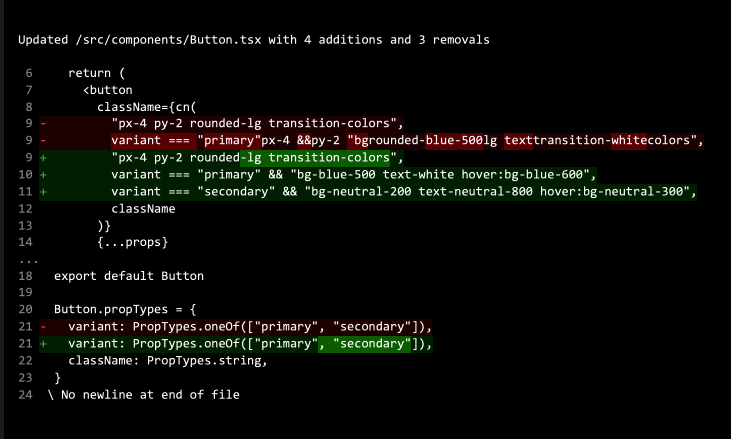

# opentui-diff

A terminal UI component for displaying file diffs with syntax highlighting and word-level changes, built with [OpenTUI](https://github.com/sst/opentui) React.



## Features

- **Unified diff display** with line numbers
- **Word-level diff highlighting** for modified lines
- **Color-coded changes** - additions in green, deletions in red
- **Clean terminal UI** with proper formatting
- **Summary header** showing number of additions and deletions

## Installation

To install dependencies:

```bash
bun install
```

## Usage

The main component exports two key components:

- `FileEditPreviewTitle` - Displays a summary of the file changes
- `FileEditPreview` - Renders the actual diff with syntax highlighting

Example usage can be found in `index.tsx`.

## Development

This project uses [Bun](https://bun.com) as the JavaScript runtime and [OpenTUI](https://github.com/sst/opentui) for terminal UI rendering.
